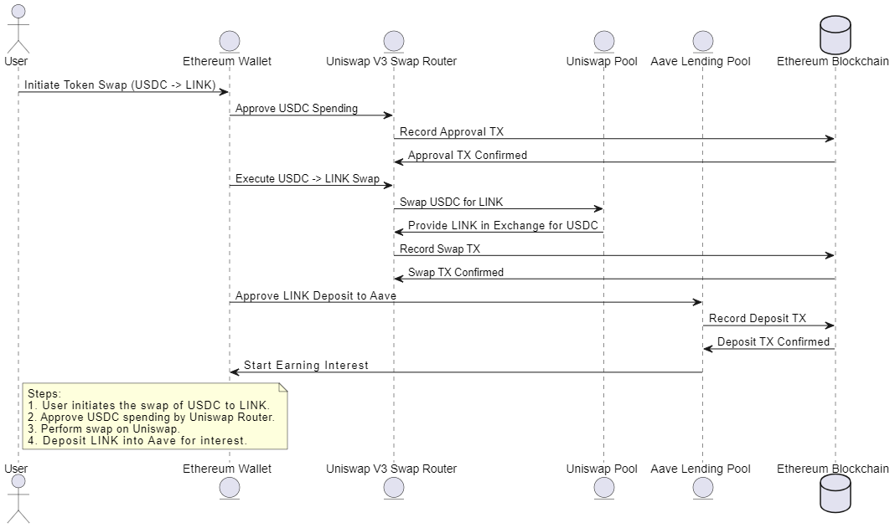

# DeFi Script - Uniswap to Aave

## Overview of Script

This DeFi script demonstrates a multi-protocol interaction between **Uniswap** and **Aave**. The script allows users to perform the following operations:

1. **Token Swap on Uniswap**: The user initiates a swap of USDC for LINK using Uniswap V3. The script handles the approval of USDC spending, fetches pool information, prepares swap parameters, and executes the token swap.
  
2. **Deposit LINK into Aave**: After swapping USDC for LINK, the script deposits the acquired LINK into Aave's Lending Pool to start earning interest on the deposited assets.

The workflow is fully decentralized, interacting directly with the Ethereum blockchain via Sepolia Testnet. The script showcases how different DeFi protocols can be composed to provide enhanced financial operations like swaps and lending.

### **Workflow Breakdown:**

- **Step 1: User Initiates Token Swap**  
  The user requests to swap USDC for LINK through Uniswap.
  
- **Step 2: Token Approval**  
  The script sends an approval transaction, allowing Uniswap's Swap Router to spend the user's USDC.

- **Step 3: Fetch Pool Information**  
  The script retrieves the details of the USDC-LINK liquidity pool, including token addresses, fees, and other parameters necessary for executing the swap.

- **Step 4: Execute Swap**  
  The swap is executed using Uniswap's `exactInputSingle` function, swapping USDC for LINK.

- **Step 5: Deposit LINK to Aave**  
  Once the swap is successful, the LINK tokens are deposited into the Aave protocol's lending pool, where the user starts earning interest on the deposited LINK.

## Diagram Illustration

The diagram below illustrates the complete flow of interactions between the user, Uniswap, Aave, and the Ethereum blockchain:



### **Diagram Explanation:**

1. **User Initiates Token Swap**  
   The user initiates the token swap from USDC to LINK by interacting with their Ethereum wallet.

2. **Approve USDC for Uniswap**  
   The wallet interacts with the Uniswap Swap Router to approve USDC for swapping. This approval transaction is recorded on the Ethereum blockchain.

3. **Execute Swap on Uniswap**  
   The script swaps USDC for LINK using the Uniswap pool. The swap transaction is confirmed on the blockchain.

4. **Deposit LINK to Aave**  
   After the swap is completed, the acquired LINK is deposited into Aave's lending pool, starting the process of earning interest. This transaction is also recorded on the Ethereum blockchain.

## Setup and Execution

### Requirements

- **Node.js**
- **Ethers.js**
- **Infura API Key** (to connect to the Ethereum Sepolia Testnet)
- **Ethereum Wallet Private Key** (with Sepolia ETH for gas fees)
- **Uniswap and Aave Contract ABIs**

### Installation

1. Clone the project repository:
   ```bash
   git clone https://github.com/yourusername/defi-script.git
